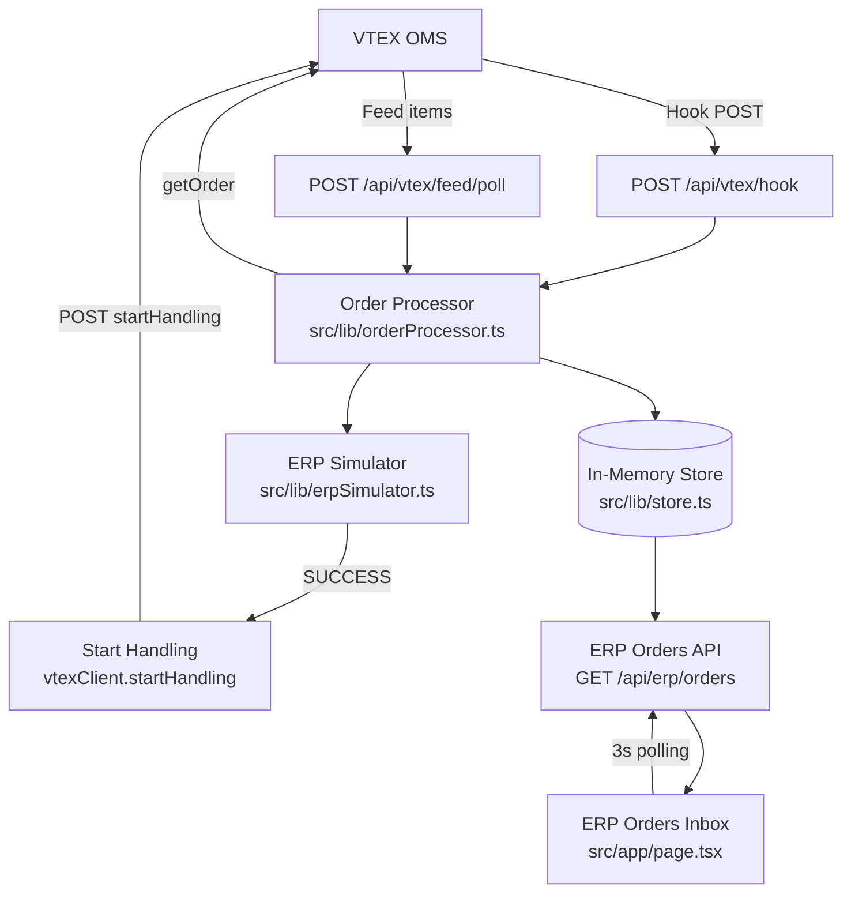
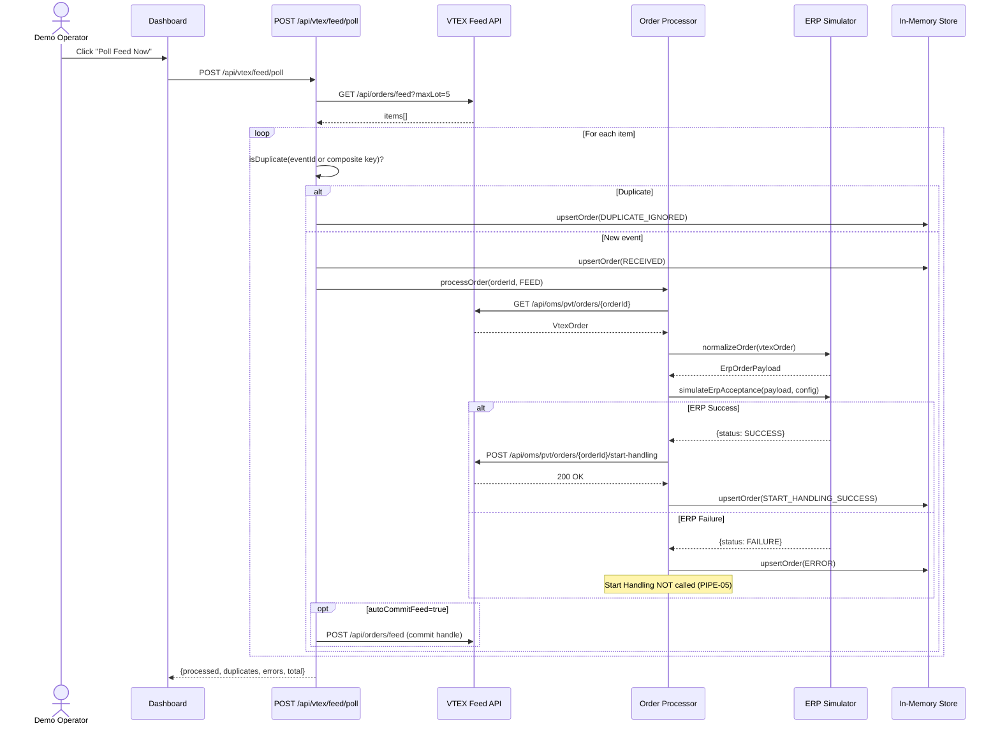
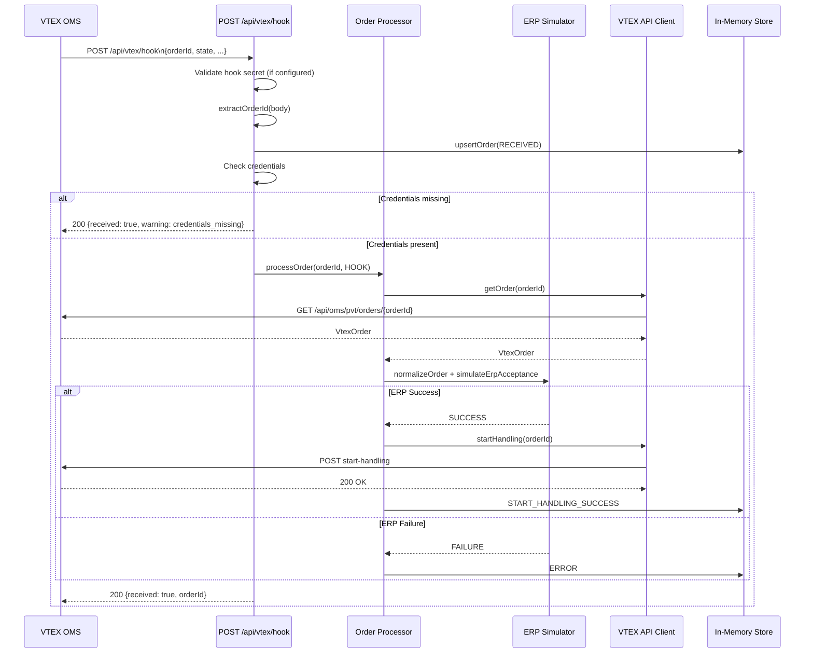

# Software Design Document — VTEX OMS to ERP Demo Console

**Version:** 1.0  
**Stack:** Next.js 16, TypeScript strict, Tailwind CSS v4, Vitest 4  
**Deployment target:** Vercel (Node.js serverless)

---

## 1. Problem Statement

When an order is placed in VTEX, it must be integrated with an external ERP system. The ERP is responsible for receiving the order, accepting it, and signalling back to VTEX (via Start Handling) that the ERP has taken ownership of fulfillment. Without this signal, VTEX holds the order in a pending state.

Most ERP integration documentation is abstract. This app makes the full handoff flow tangible and explorable: it receives VTEX order events (via Hook or Feed), fetches full order details, normalizes them into an ERP-style payload, simulates ERP acceptance, and calls Start Handling. Every step is visible in a dashboard with per-order timelines, raw payloads, and retry actions.

**The app is intentionally a demo tool.** It is not a production ERP adapter. It uses in-memory state, has no authentication, and performs no actual ERP API calls. It is designed to run on Vercel for free-tier demos and to serve as a starting point for production implementations.

---

## 2. Business Context

VTEX OMS supports two integration patterns for external ERPs:

- **Feed:** The ERP polls a queue (VTEX Feed API) to retrieve pending order events. The ERP controls the polling cadence.
- **Hook:** VTEX pushes order event notifications to an endpoint configured by the ERP. The ERP reacts to push events.

Both patterns deliver an event containing an `orderId` (and optionally the order state). The ERP must then call the VTEX Get Order API to retrieve full order details, process the order internally, and call VTEX Start Handling to acknowledge ownership.

This app simulates the ERP side of both patterns.

---

## 3. MVP Scope

Included:

- VTEX credential configuration (via environment variables and runtime config panel)
- Hook endpoint (`POST /api/vtex/hook`)
- Manual Feed polling (`POST /api/vtex/feed/poll`)
- VTEX Get Order API client
- ERP payload normalizer with PII masking
- Simulated ERP acceptance (configurable failure mode)
- Mandatory VTEX Start Handling after ERP success
- Three Start Handling guards preventing double-calls and invalid calls
- Unified ERP Orders Inbox with filtering, search, and sorting
- Accordion-based order detail (8 sections)
- Processing timeline per order
- Technical event log
- Idempotent event deduplication
- Basic error handling and retry actions
- PII masking at ingestion time

Not included (see v0 Improvement Backlog):

- Persistent database
- Background scheduled polling (Vercel Cron)
- Retry queue with exponential backoff
- Dead-letter queue
- Multi-tenant configuration
- User authentication and RBAC
- Real outbound ERP API integration
- CI/CD pipeline
- Docker support

---

## 4. Actors

| Actor | Role |
|---|---|
| **VTEX OMS** | Source of truth for orders. Sends hook events (push) and serves Feed queue (pull). Receives Start Handling signals. |
| **Feed Consumer** | The `POST /api/vtex/feed/poll` endpoint. Polls VTEX Feed queue on demand, deduplicates events, processes each order. |
| **Hook Receiver** | The `POST /api/vtex/hook` endpoint. Accepts push notifications from VTEX. Extracts orderId and runs the pipeline. |
| **Order Processor** | `src/lib/orderProcessor.ts`. Orchestrates the full pipeline: Get Order → normalize → ERP simulate → Start Handling. |
| **Simulated ERP** | `src/lib/erpSimulator.ts`. Normalizes VTEX orders into ERP payloads and simulates acceptance (configurable failure mode). |
| **Demo Operator** | The person running the demo. Configures credentials, triggers Feed polls, views the dashboard, uses retry actions. |

---

## 5. Architecture Diagram



---

## 6. Feed Flow Sequence Diagram



---

## 7. Hook Flow Sequence Diagram



---

## 8. Data Model

### ErpOrderRecord

The primary internal record stored in the in-memory store per order.

| Field | Type | Description |
|---|---|---|
| `id` | `string` | App-internal ID (equals `orderId` for non-duplicate records) |
| `orderId` | `string` | VTEX orderId (e.g., `1234567890-01`) |
| `sequence` | `string?` | VTEX sequence number |
| `source` | `"FEED" \| "HOOK"` | How the event was received |
| `vtexStatus` | `string?` | Current order status from VTEX Get Order |
| `erpStatus` | `ErpStatus` | Current ERP processing status (see below) |
| `startHandlingStatus` | `"NOT_STARTED" \| "SUCCESS" \| "ERROR"` | Start Handling call result |
| `customerName` | `string?` | Customer full name |
| `customerEmailMasked` | `string?` | Masked email, e.g., `d***@vtex.com` |
| `totalValue` | `number?` | Total order value in VTEX currency units (divide by 100 for BRL) |
| `itemCount` | `number?` | Number of line items |
| `paymentSummary` | `string?` | Payment system name (e.g., `Visa`) |
| `shippingSummary` | `string?` | Selected SLA name |
| `receivedAt` | `string` | ISO 8601 timestamp when event was received |
| `lastAttemptAt` | `string?` | ISO 8601 timestamp of the most recent pipeline run |
| `attempts` | `number` | Total pipeline run attempts |
| `errorMessage` | `string?` | Last error message if pipeline failed |
| `vtexOrderRaw` | `unknown` | PII-masked raw VTEX Get Order response |
| `erpPayload` | `ErpOrderPayload?` | Normalized ERP payload |
| `startHandlingResponse` | `unknown` | VTEX Start Handling response body |
| `timeline` | `ErpTimelineEntry[]` | Ordered list of processing steps |

### ErpStatus values

| Status | Meaning |
|---|---|
| `RECEIVED` | Event received, pipeline not yet started |
| `PROCESSING` | Pipeline is actively running |
| `ERP_ACCEPTED` | ERP simulation succeeded |
| `START_HANDLING_SUCCESS` | VTEX Start Handling succeeded |
| `START_HANDLING_ERROR` | VTEX Start Handling failed after ERP success |
| `ERROR` | Pipeline failed (Get Order error or ERP simulation failure) |
| `DUPLICATE_IGNORED` | Event deduplicated; not processed |
| `MANUALLY_RESOLVED` | Operator manually marked as resolved |

### ErpTimelineEntry

Each pipeline step writes a timeline entry:

```ts
type ErpTimelineEntry = {
  timestamp: string;   // ISO 8601
  step: PipelineStepName | string;
  status: "SUCCESS" | "ERROR" | "INFO" | "SKIPPED";
  message?: string;
};
```

Pipeline step names: `EVENT_RECEIVED`, `GET_ORDER_REQUESTED`, `GET_ORDER_SUCCESS`, `GET_ORDER_ERROR`, `ERP_PAYLOAD_NORMALIZED`, `ERP_SIMULATION_STARTED`, `ERP_SIMULATION_SUCCESS`, `ERP_SIMULATION_ERROR`, `START_HANDLING_REQUESTED`, `START_HANDLING_SUCCESS`, `START_HANDLING_ERROR`, `FEED_ITEM_COMMITTED`, `DUPLICATE_IGNORED`, `MANUALLY_RESOLVED`.

---

## 9. Start Handling Guards

Three guards in `src/lib/orderProcessor.ts` prevent invalid Start Handling calls:

| Guard | Code | Trigger | Action |
|---|---|---|---|
| **PIPE-07** | Already handled | `startHandlingStatus === 'SUCCESS'` at pipeline entry | Writes a SKIPPED timeline entry and exits pipeline immediately |
| **PIPE-06** | Get Order failed | `vtexClient.getOrder()` throws | Writes `GET_ORDER_ERROR` timeline entry, sets status to `ERROR`, exits without calling Start Handling |
| **PIPE-05** | ERP simulation failed | `simulateErpAcceptance()` returns `FAILURE` | Writes `ERP_SIMULATION_ERROR` timeline entry, sets status to `ERROR`, exits without calling Start Handling |

Start Handling is only called when all three guards pass: the order has not been successfully handled before, Get Order succeeded, and ERP simulation returned SUCCESS.

---

## 10. Idempotency Strategy

VTEX Feed can re-deliver the same event. The deduplicator in `src/lib/deduplicator.ts` prevents double processing:

1. **Primary key:** If the feed item has an `eventId` field, use `eventId:{value}` as the deduplication key.
2. **Composite fallback:** If `eventId` is absent (common in VTEX Feed v3), use `composite:{orderId}:{state}:{timestamp}`. This prevents processing the same event twice while still allowing the same order to be processed again if it transitions to a new state (e.g., `ready-for-handling` → re-delivery).
3. **Storage:** Processed keys are stored in `globalThis.__processedKeys` (a `Set<string>`). The set is capped at 5,000 entries; older entries are evicted when the limit is exceeded.
4. **Hook deduplication:** The hook endpoint uses the `orderId` as the record key. If a hook for the same orderId arrives while the pipeline is running, the `upsertOrder` call overwrites the existing record but the pipeline guards prevent Start Handling from being called twice.

---

## 11. Security Model

| Concern | Implementation |
|---|---|
| VTEX credentials | Read from server-side `process.env` only. Never returned in API responses. `AppConfigPublic` type explicitly excludes `appToken`. |
| App Token logging | Never logged anywhere in the codebase. `config.ts` includes explicit comments. |
| PII masking | Applied at ingestion time in `src/lib/erpSimulator.ts` (via `src/lib/piiMasker.ts`). Email: `d***@domain.com`. Document: `***-XX` (last 2 digits). Phone: `(**) *****-****`. Address: street truncated to 4 chars + `***`. The PII-masked payload is what gets stored in `vtexOrderRaw`. |
| Hook secret | Optional `x-demo-hook-secret` header checked in `POST /api/vtex/hook`. If `DEMO_HOOK_SECRET` is unset, validation is disabled. This is demo-grade security only. |
| Token display | The Configuration Panel never renders the App Token after saving. `appTokenConfigured: boolean` is returned instead. |

### What this demo does NOT implement

- HMAC-SHA256 webhook signature validation
- Encryption at rest for credentials
- Rate limiting on API routes
- User authentication
- Role-based access control
- Audit log

See `docs/SECURITY.md` for the full production hardening checklist.

---

## 12. In-Memory Store

`src/lib/store.ts` uses `globalThis` singletons to survive Next.js Fast Refresh module re-executions without resetting state during development.

**Critical limitations:**

- State is lost on every cold start (Vercel serverless function recycle).
- State is NOT shared across multiple Vercel instances (horizontal scale).
- The event log is capped at 1,000 entries; the dedup key set is capped at 5,000 entries.
- This store is intentionally the only persistence layer for the MVP. Replacing it with Vercel KV, Supabase, or DynamoDB requires only swapping the function bodies in `store.ts` — all callers remain unchanged.

**API routes that import from store.ts must declare `export const runtime = 'nodejs'`** — Edge runtime isolates do not share `globalThis` state.

---

## 13. API Design Summary

All routes are in `src/app/api/`. Full documentation in `docs/API.md`.

| Method | Path | Purpose |
|---|---|---|
| `POST` | `/api/vtex/hook` | Receive VTEX hook event |
| `POST` | `/api/vtex/feed/poll` | Poll VTEX Feed queue |
| `POST` | `/api/vtex/orders/[orderId]/start-handling` | Manual Start Handling trigger |
| `GET` | `/api/erp/orders` | List orders (filterable) |
| `GET` | `/api/erp/orders/[orderId]` | Single order detail |
| `POST` | `/api/erp/orders/[orderId]/reprocess` | Re-run full pipeline |
| `POST` | `/api/erp/orders/[orderId]/retry-start-handling` | Retry Start Handling only |
| `POST` | `/api/erp/orders/[orderId]/resolve` | Mark as MANUALLY_RESOLVED |
| `GET` | `/api/config` | Public config (no token) |
| `POST` | `/api/config` | Update runtime config |
| `GET` | `/api/erp/events` | Technical event log |

---

## 14. Observability and Logging

- All pipeline steps write timeline entries to the per-order record.
- The technical event log (`EventLogEntry[]`) records source-level events (FEED, HOOK, SYSTEM) with level INFO/WARN/ERROR.
- The event log is capped at 1,000 entries and available via `GET /api/erp/events`.
- The app token is never included in any log message. Error messages from VTEX API errors include the URL and HTTP status only.
- There is no structured external logging (e.g., Datadog, Logtail) in the MVP.

---

## 15. Deployment Model

The app is a standard Next.js application. All API routes are serverless Node.js functions on Vercel. There are no background workers, cron jobs, or external services required for the MVP.

The VTEX client makes outbound HTTPS calls to `https://{account}.{environment}` — all communication is server-to-server.

The dashboard is a client-side React component that polls `GET /api/erp/orders` every 3 seconds (`DASHBOARD_POLL_INTERVAL_MS`).

See `docs/DEPLOYMENT.md` for step-by-step deployment instructions.

---

## 16. v0 Improvement Backlog

These items are deferred post-MVP:

1. **Persistent storage** — Vercel KV, Supabase, PostgreSQL, or DynamoDB to survive cold starts and support horizontal scale.
2. **Background polling** — Vercel Cron job for scheduled Feed consumption without manual triggers.
3. **Retry queue with exponential backoff** — Queue failed orders for automatic retry with delay.
4. **Dead-letter queue** — Isolate permanently failed orders for manual review.
5. **Multi-tenant support** — Per-account configuration stored in the database.
6. **Authentication** — OAuth or session-based admin auth for the configuration panel and API routes.
7. **RBAC** — Role-based access so read-only operators cannot change credentials.
8. **Audit log** — Immutable record of all configuration changes and pipeline actions.
9. **Webhook signature validation** — HMAC-SHA256 validation of VTEX hook payloads.
10. **Structured observability** — Correlation IDs, structured JSON logs, integration with Datadog/Logtail/OpenTelemetry.
11. **Real ERP integration** — Replace `erpSimulator.ts` with calls to an actual ERP endpoint.
12. **Order status mapping** — Configurable mapping from VTEX order states to ERP-specific status codes.
13. **Feed configuration editor** — UI to update VTEX Feed filter rules without direct API calls.
14. **Mock VTEX mode** — Seed data for demos without a live VTEX account.
15. **Export** — JSON/CSV export of order inbox contents.
16. **Docker support** — Containerized deployment for non-Vercel environments.
17. **CI/CD pipeline** — GitHub Actions workflow for lint, test, and deploy on push.
18. **API rate limit protection** — Per-IP or per-key rate limiting on hook and poll endpoints.
